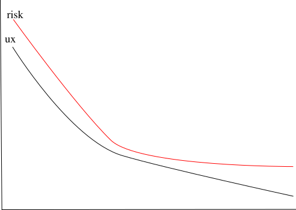

## Learn you some security for the great good!
(keeping the bad guys at bay)

---
### The plan

* Y?
* Framework of thought
* The Attacker mindset
* Protecting
* Passwords, secrets and lies
* Seconomics

---

# Y?

Note:

Motivation:

* The increased use of an online persona in the last decades

* The increased sophistication of online attacks


We aim to provide the following:

1. A framework of thinking on personal security

2. Practical tools for increasing security posture

3. Increase awareness of what is possible
---

# Framework of thought

Note:

---

### Security

"The state of being free from danger or threat."

---

### Defense in depth


Note: for us software nerds if quite familiar every software problem is solve by another layer of in-direction, multiple layers combined, from 2FA

---

### Zero Trust


Note:

Useful when we come to design our systematic approach around trust, we consider any other system as untrusted and design our protection layers to match.

---

### Least privilege


Note: a no cookie for you

---

### The Halting Problem


Note:

This is why detecting malware in the general case is hard

See:
 * Halting problem applicability [this](https://security.stackexchange.com/questions/30877/what-applicability-does-the-halting-problem-have-to-infosec).
 * Compute security [version](https://cs.stackexchange.com/questions/64471/computer-security-versions-of-the-halting-problem) of the halting problem.
 * Defcon turing machine why is it easier to [hack](https://www.cisoplatform.com/profiles/blogs/defcon-turing-machine-halting-problem-why-is-it-easier-to-hack-th)
 * This is why we can't 100% grantee what the software will do, yes even in appstores ;)

---

### Security by obscurity


Note:

For example port knocking

Close source security

Legal based security

---

# The Attacker mindset


---

### Actors

   * State
   * Organized crime
   * Hacktivists
   * Script kiddies

---


### Motivation

  * Financial
  * Ideological
  * Military
  * Extortion
  * Industrial


---

### Scope

* Single Targeted (spear phishing)
* Group Targeted (watering hole)
* Wide net (automated, large scale)

Note:

* An [example](https://threatpost.com/zloader-google-adwords-windows-defender/169448/) of a wide net is using Google adwords to spread maleware

* A target attack [North Korea targeting security researchers](https://blog.google/threat-analysis-group/new-campaign-targeting-security-researchers/)

* Botnets networks offer another example of large scale automated attack

* Another [example](https://www.proofpoint.com/us/blog/threat-insight/i-knew-you-were-trouble-ta456-targets-defense-contractor-alluring-social-media) of a targeted attack
---

### Peneration flow


---

### Reverse shell


---

### Meterpreter Demo

<video width="320" height="240" controls>
  <source src="./video/metasploit-v1.mp4" type="video/mp4">
</video>

Note:

1. We show how a seemingly benign binary can contain an RS
2. We see the different stages of Meterpreter deployment, from simple RS up to the deployment of a full interactive shell
3. We get the current use UID and how long he has been active
4. We take a screenshoot
5. We turn on keyscan grabbing and get what the user types
6. We turn on full live screenshare
7. We download and upload a file
8. We drop to standard shell on the machine

---

### Hardware based attacks

* Malicious USB HID devices ([1](https://www.youtube.com/watch?v=Y1xzkHOWFkA))
* Thunderbolt DMA
* Lan plugs
* Airtags tracking
* [Fake](https://www.forbes.com/sites/leemathews/2021/06/18/cybercrooks-are-mailing-users-fake-ledger-devices-to-steal-their-cryptocurrency/?sh=3faa7d6adbad) Ledger devices

---

[](https://www.youtube.com/watch?v=Y1xzkHOWFkA)

---


---

### DuckyScript

```
REM Type Hello World into Windows notepad.
DELAY 1000
GUI r
DELAY 100
STRING c:\windows\notepad.exe
ENTER
DELAY 1000
STRING Hello World
```

---

### The 7 principles (influence)

* Reciprocity
* Liking
* Social Proof
* Authority
* Scarcity
* Commitment in Consistency
* Unity

Note:

Examples per principle:
* Reciprocity: John gave me access when I needed it
* Liking: attractive profile picture
* Social Proof:  A lot of likes on a post
* Authority: ATO fake calls
* Scarcity: a rare opportunity
* Commitment in Consistency:
* Unity: We both play hockey

---

### Identity Deception

* Email from header
* Caller ids (inc SMS)
* Urls ([са.com](https://www.xn--80a7a.com/))
* Faking a [reboot!](https://www.schneier.com/blog/archives/2022/01/faking-an-iphone-reboot.html)
* Look&feel

Note: see https://en.wikipedia.org/wiki/IDN_homograph_attack for URL encoding attacks

---

# Protecting


---

### Compartmentalize

* Sandbox heavily
* Use Air gapped devices
* Separate instances by use

---

### Qubes demo

Note: provides cilpboard protection, network isolation, local privesc mitigation (excluding VM escapes!)

---

### General OS hardening

* Remove unused services
* Un-install unused apps
* Don't run as root
* Limit expose ports (firewall or bind to local)

---

### Mobile hardening (1)

* Choose Reputable vendor
* Use >= 2 phones (per use case)
* No root

---

### Mobile hardening (2)

* Reset/Restart once in a while
* Deprecate non-updatable devices
* Minimize installed apps and permissions
* Use browser when in doubt

Note:
* Ditch when no current and trusted ROM is available beyond official support
* Track permission with time (they can change)

---

### Browser hardening

* Minimal extensions set
* Upgrade constantly
* Don't trust PDF viewer blindly
* Run single site per sandbox (i.e Qubes)

---

### Network hardening

* segmented networks (VLAN's)
* Monitor traffic
* block based onGeo/reputation
* Don't trust WIFI security

Note:

* One option of increasing security on wifi is using a mesh VPN solution like Nebula

---

### Trust

* Open source
* Prefer audited services
* Understand permissions
* Frequent patch cycles

---

### Verify

* You can't prove security you can only refute it:
  * Check activity logs.
  * Monitor your network/services (ELK/Pfsense)
  * Look for things which are out of place*

Note:

Things to watch out for:

* Odd DNS lookups
* Email inbox filters, read emails
* Crashing applications
* Odd services/files/processes
* High bandwidth usage

---

### Patch yourself!

* Delay (don't rush into action).
* Prefer Pull over push.
* Use outbound channels for verification.
* Don't be embarrassed to question.

---

# Passwords secrets and lies!

---

### Complexity


---

### Passwords

* Highly complex
* Unique per domain/use case
* Stored online (not a plugin)/gapped offline.
* Have I been pawned

Note:
* mention Travis [post](https://lock.cmpxchg8b.com/passmgrs.html?m=1) on the issues with browser plugins,
* Choose Wisely [Kaspersky Password Manager Vuln](https://www.schneier.com/blog/archives/2021/07/vulnerability-in-the-kaspersky-password-manager.html)
* Recommended tools: BW and pass, pwgen, keepass (again prefer those that support some form of hardware 2FA).

---

### Tidbits

* Pins
* Secret questions (not so secret)
* Patterns

Note:

Pins are usually a weak form of a password (4-6 range)

---

### Attacks

* Remote (using dumps):
  * Stuffing
  * Spraying
* Local:
  * Hash cracking (John, Hashcat)
  * Wordlists/permutations

---

### 2FA

* Prefer hardware (Yubikey)
* App Codes interception
* SMS sucks (SIM swapping and interception)
* Biometric not so [much](https://security.stackexchange.com/questions/198512/how-secure-is-the-fingerprint-sensor-in-the-pixel-3)
---

# Seconomics
---

### stats

* 20142 vuln in 2021, 2984 in 2022
* Oldest CVE discovered as 21yo
* 19K out of 170k are critical (11%)


Note:

Based on https://www.comparitech.com/blog/information-security/cybersecurity-vulnerability-statistics/


CVE critically stats https://www.cvedetails.com/

---

### Risk vs cost


---

### UX vs Risk



---

### Asymmetrystan

* Attackers have the advantage.

* Defense is a risk/cost/ux balancing act.

* Induction vs deduction (The Turkey).

Note:

We are use to thinking in gausian terms (i.e normal distribution), security doesn't comply with that, security in black swan terms is from exremistan!

Scalable vs non scalable (security is scalable due to automation)

Extermistan vs Mediocristan (std deviation bell curve vs likelihood of extreme events)

---

### The end, stay safe

Questions?
